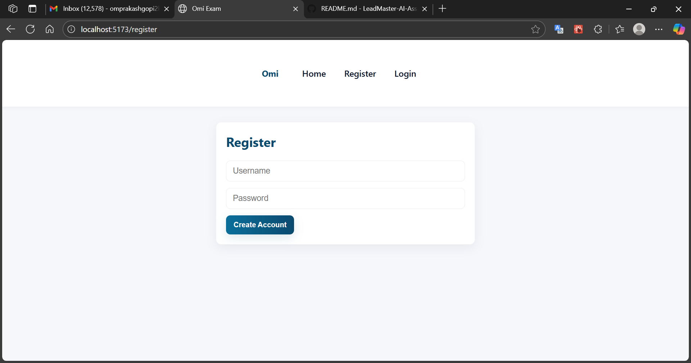
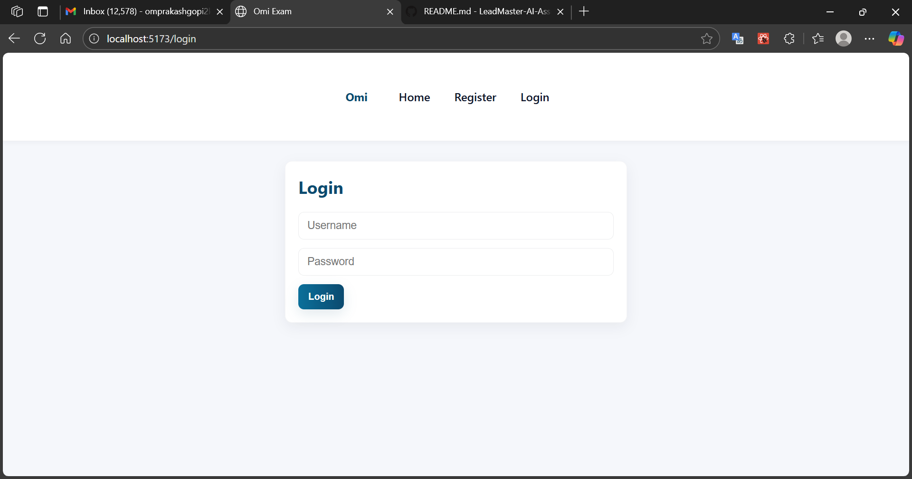
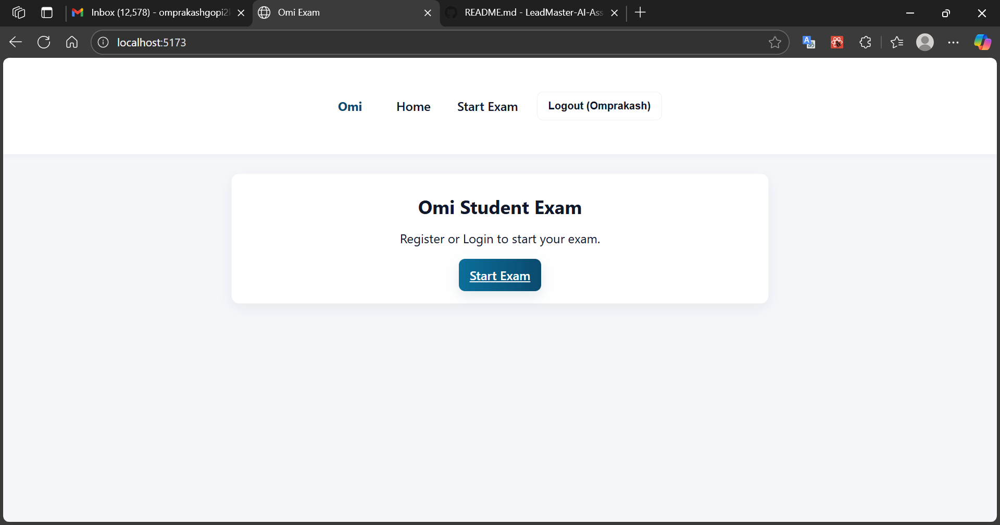
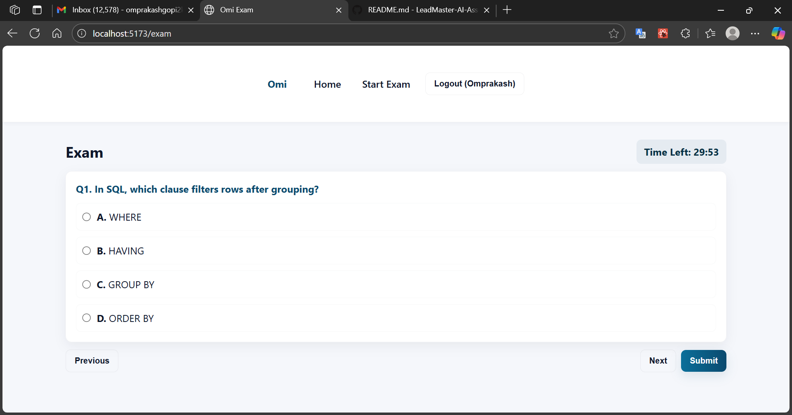
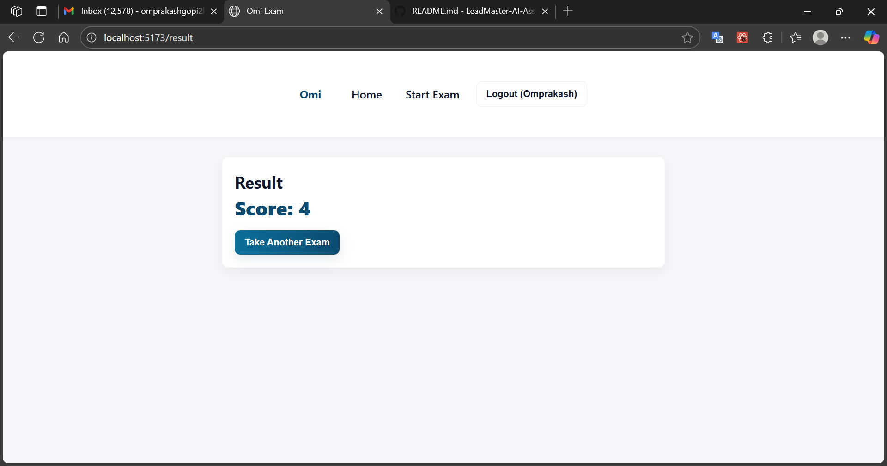

# 🎓 LeadMasters AI – Online Exam System

An **AI-driven online exam platform** built with **Django REST Framework** (backend) and **React** (frontend).  
It provides secure authentication, randomized question selection, automated scoring, and result management.

---

## **🚀 Features**
- 🔐 **JWT Authentication** (Register, Login, Refresh)
- 📝 Start an exam with random questions
- 🧠 Automatic scoring on submission
- 📊 View exam results instantly
- 🛠 Seeder command to populate questions
- 🌐 Fully API-driven → Easily testable via **Postman**

---

## **🛠️ Tech Stack**
- **Backend:** Django, Django REST Framework, SimpleJWT
- **Frontend:** React (Vite), Axios, React Router
- **Database:** SQLite (default) / PostgreSQL (optional)
- **API Testing:** Postman

---

## **📂 Project Structure**

LeadMasters-AI-ASSESSMENT/<br>
├─ backend/<br>
│ ├─ manage.py<br>
│ ├─ requirements.txt<br>
│ ├─ .env.example<br>
│ ├─ Dockerfile<br>
│ ├─ docker-compose.yml<br>
│ └─ omi/<br>
│ ├─ __init__.py<br>
│ ├─ settings.py<br>
│ ├─ urls.py<br>
│ ├─ wsgi.py<br>
│ └─ api/<br>
│ ├─ __init__.py<br>
│ ├─ apps.py<br>
│ ├─ models.py<br>
│ ├─ serializers.py<br>
│ ├─ permissions.py<br>
│ ├─ views.py<br>
│ ├─ urls.py<br>
│ ├─ admin.py<br>
│ └─ management/<br>
│ └─ commands/<br>
│ └─ seed_questions.py<br>
│<br>
└─ frontend/<br>
├─ index.html<br>
├─ package.json<br>
├─ vite.config.js<br>
└─ src/<br>
├─ main.jsx<br>
├─ App.jsx<br>
├─ api.js<br>
├─ auth.jsx<br>
├─ components/<br>
│ ├─ Navbar.jsx<br>
│ └─ Timer.jsx<br>
└─ pages/<br>
├─ Register.jsx<br>
├─ Login.jsx<br>
├─ StartExam.jsx<br>
├─ Exam.jsx<br>
└─ Result.jsx<br>

## **⚡ Backend Setup**
```bash
git clone https://github.com/Omprakash1101/LeadMaster-AI-Assessment.git
cd LeadMaster-AI-Assessment/backend
python -m venv .venv
source .venv/bin/activate 
pip install -r requirements.txt
python manage.py makemigrations
python manage.py migrate
python manage.py seed_questions
python manage.py runserver
```
## **⚡ frontend Setup**
```bash
cd ../frontend
npm install
npm run dev
```

## **Sample Output**











## **📞 Support**

For any queries or assistance, feel free to reach out:

**Author:** Omprakash G<br>
**Email:** omprakashgopi2k05@gmail.com<br>
**GitHub:** @Omprakash1101
